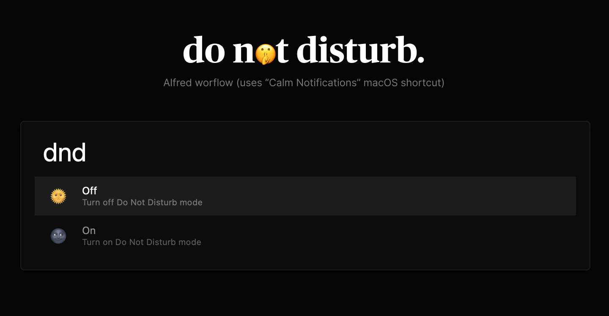

# Alfred - Do Not Disturb

**Alfred - Do Not Disturb** is an [Alfred](https://www.alfredapp.com/) workflow to turn on/off macOS _Do Not Disturb_ feature on macOS Monterey and later.

_The Alfred Theme shown above is Nero, available [here](https://github.com/lucaorio/nero)._

## Contents

- [Alfred - Do Not Disturb](#alfred---do-not-disturb)
  - [Contents](#contents)
  - [Requirements](#requirements)
  - [Installation](#installation)
  - [Usage](#usage)
  - [License](#license)
  - [Contacts](#contacts)

## Requirements

Simply download the [Calm Notifications (macOS Shortcut)](https://github.com/vitorgalvao/alfred-workflows/blob/master/CalmNotifications/source/Calm%20Notifications.shortcut) and double click to install it.

## Installation

**CLI:**

```shell
$ git clone http://github.com/lucaorio/alfred-do-not-disturb
$ open alfred-do-not-disturb/do-not-disturb.alfredworkflow
```

**Manual**:

- Download the repository
- Open `alfred-do-not-disturb` folder, and double-click `do-not-disturb.alfredworkflow`

## Usage

- Trigger Alfred `cmd+space` _(your shortcut may change)_
- Type `dnd`
- Use the arrow keys to turn Do No Disturb on/off

## License


## Contacts

- 🐦 Twitter [@lucaorio](http://twitter.com/@lucaorio_)
- 🕸 Website [lucaorio.com](http://lucaorio.com)
- 📬 Email [luca.o@me.com](mailto:luca.o@me.com)
